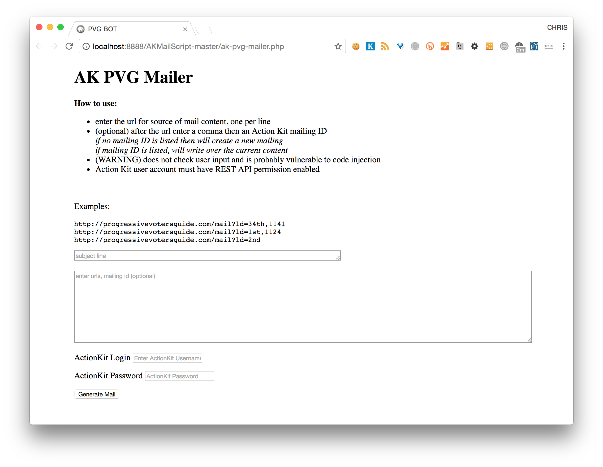

# ProgressiveVotersGuide.com ActionKit Mailer Bot

This script [`ak-pvg-mailer.php`](https://github.com/chrisscastaneda/PVG-AK-Mailer-Bot/blob/master/ak-pvg-mailer.php) automates the process of emailing customized versions of the ProgressiveVotersGuide.com to the members of Fuse Washington.  We designed the ProgressiveVoterGuide website to generate the html content for the customized emails that we would then stage in our ActionKit install to send to our members.  

## Set Up

Load this repo onto your local PHP server and load the page [`ak-pvg-mailer.php`](https://github.com/chrisscastaneda/PVG-AK-Mailer-Bot/blob/master/ak-pvg-mailer.php).  (Note: I would not recommend running this on a publicly accessible server on the Internet.  This was not built with security in mind. )